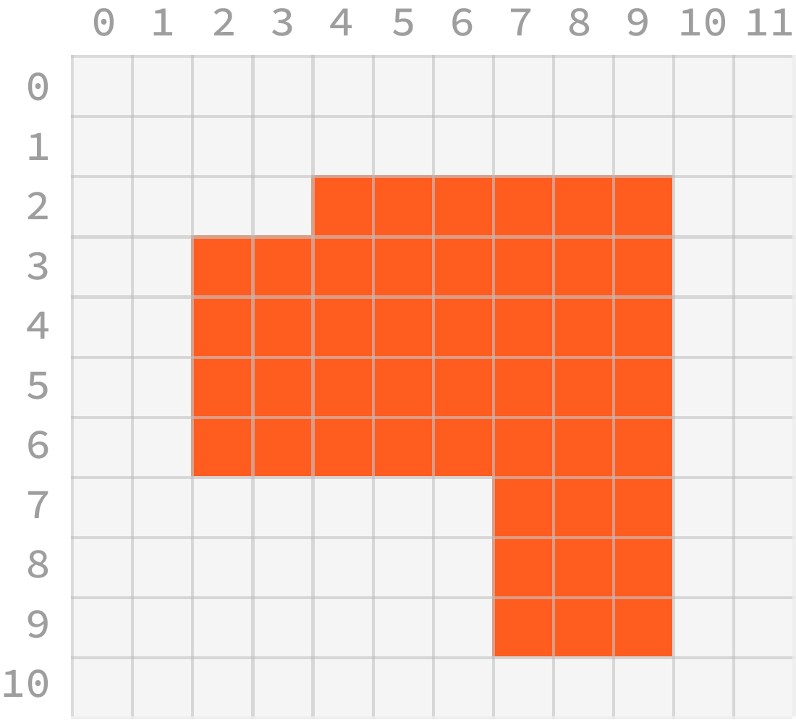
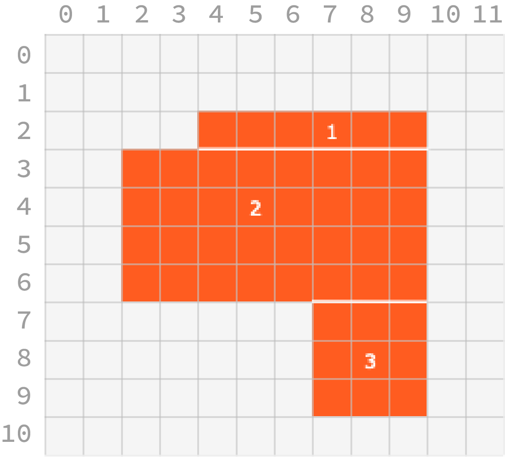
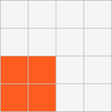
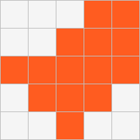
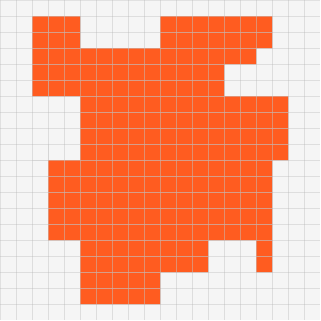

# Kotlin - Minimum Rectangle

Source: [https://platform.entwicklerheld.de/challenge/minimum-rectangle](https://platform.entwicklerheld.de/challenge/minimum-rectangle)

A very good explanation of the algorithm can be found
[here](https://stackoverflow.com/questions/5919298/algorithm-for-finding-the-fewest-rectangles-to-cover-a-set-of-rectangles-without)

## Description

At Craftnote our mission is to provide a digital platform that makes life easier for craftsmen. As the latest member of our development team, your challenge is to provide an algorithm that solves the problem of minimum rectangle partition:
An new vinyl floor has to be placed in an apartment. The floor plan of the apartment is given as a rasterized set of points in a rectilinear grid.

In order to install the floor it has to be cut into rectangles. The cutting machine is expensive to operate and can only cut full lines. Your task is to develop an algorithm that, given a floor plan as a continuous set of points in the grid, calculates the *minimum number of rectangles* the plan can be partitioned into.

## Stage 1

### Goal

At Craftnote our mission is to provide a digital platform that makes life easier for craftsmen. As the latest member of our development team, your challenge is to provide an algorithm that solves the problem of minimum rectangle partition:
An new vinyl floor has to be placed in an apartment. The floor plan of the apartment is given as a rasterized set of points in a rectilinear grid.

In order to install the floor it has to be cut into rectangles. The cutting machine is expensive to operate and can only cut full lines. Your task is to develop an algorithm that, given a floor plan as a continuous set of points in the grid, calculates the *minimum number of rectangles* the plan can be partitioned into.

### Scenario 1

First we want to get familiarized with the problem by creating an example floor plan. Create a floor plan as a 2 dimensional boolean array.

Create a floor plan as a 2 dimensional boolean array. The first dimension should be columns and the second dimension should be rows!

The plan should be continuous, that means there is a path from each point to each other point via neighbors above, below, left, or right (not diagonally).

It should consist of at least `10` points, i.e. at least 10 fields of the array should be set to true.

It should have a minimum rectangle partition of exactly `4`. [Not checked yet, by tests] It should not contain any "holes", that means that from each point that is not part of the plan there should be a path to the edge of the grid, without crossing any points that are part of the plan.

## Stage 2

### Goal

Now we will implement the `Point` class that we will later use for our algorithm.

### Scenario 1: Create a Point class

Now we will implement the `Point` class that we will later use for our algorithm.

First we add the basic functionality. Implement the `Point(int x, int y)` constructor as well as the getters `int getX()` and `int getY()`.

Make sure to validate the `x` and `y` values that are passed to the constructor. It should throw a `java.lang.IllegalArgumentException` if any of these values are negative.

We now want two Points to be equal whenever the `x` and `y` properties are equal.

In the following implementation for the algorithm we need to be able to use the `Point` class in a `HashSet`. We need to make sure that when adding two `Points` with the same `x` and `y` properties, the set will treat them as equal.

## Stage 3

### Goal

In addition to the `Point` class from the previous stage we also need a class that represents our `Grid`.

### Scenario 1: Class definition and utility methods

In addition to the `Point` class from the previous stage we also need a class that represents our `Grid`.

First we implement the main functionality. Implement the `Grid(int width, int height)` constructor, the getters `int getWidth()` and `int getHeight()`.

The Grid class should has a `void addPoint(Point point)` method that adds a point to the grid as well as the `boolean hasPoint(Point point)` method that checks if a point is set.

Make sure to validate the coordinates of a point before adding it. The void `addPoint(Point point)` method should throw a `java.lang.IllegalArgumentException` if the point's coordinates are outside the grid's boundaries.

### Scenario 2: A custom toString() method

In order to display our grid we want to be able to get a `String` representation of it. Override the `toString()` method and return a string with the following properties

Draw the grid such that x coordinates grow to the right and y coordinates increase in every row:

Use the unicode character ■ (`BLACK SQUARE (U+25A0)`) for representing the added points of the grid.  
Use the unicode character □ (`WHITE SQUARE (U+25A1)`) for the remaining grid points.

## Stage 4

### Goal

Now that we familiarized ourselves with the problem domain and created the domain models we want to develop the algorithm that calculates the minimum partition of rectangles of the floor plan represented in the grid.

A general outline of the solution has been published in section 3 of the paper Graph-Theoretic Solutions to Computational Geometry Problems by David Eppstein. In our case we assume that there are no "holes" in the floor plan.

Important Hints:
* The `Point` and `Grid` classes are available as implemented in the previous steps.
* First identify all concave corners and connect them to segments that are fully contained inside the polygon.
* If none of these segments intersect there is a trivial solution.
* Otherwise build the intersection graph using the `BipartiteGraph` class from the `de.craftnote.challenge.support.hopcroft` package. Each vertex of this graph is identifyied by a positive number (starting with 1). Use the `addEdge(Edge edge)` method to add an edge to the graph.
* You can use the `HopcroftKarp::getMaximumMatch()` method for calculating a maximum match of the bipartite intersection graph. It will return a collection of those edges that are included in the match.

### Scenario 1: Minimum rectangle partition of 1
    
In the first scenario we look at the trivial case of just one point in the grid. We define a singular point to be a rectangle by itself, so the result should be `1`.

### Scenario 2: Minimum rectangle partition of 1 - again

In this equally trivial scenario we have a single square floor plan with an obvious partition of `1`.

### Scenario 3: A 'C' Shape

Now we look at a "C" shaped floor plan that needs at least `3` rectangles.

### Scenario 4: A 'T' Shape

A "T" shaped floor plan always needs just `2` rectangles.

### Scenario 5: More complicated floor

This more complicated floor plan has a minimum partition of `4`.

### Scenario 6: Minimum rectangle partition of 5
   
The algorithm should return the correct partition of `5` for this floor plan.

### Scenario 7: Minimum rectangle partition of 9
    
Finally this bigger and more complicated floor plan has a minimum partition of `9`.
    

    