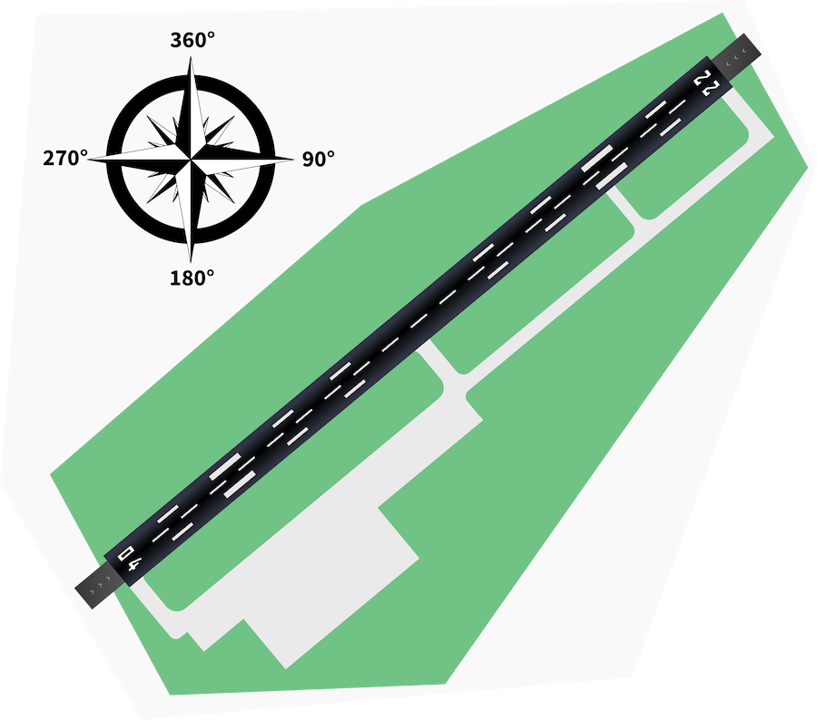
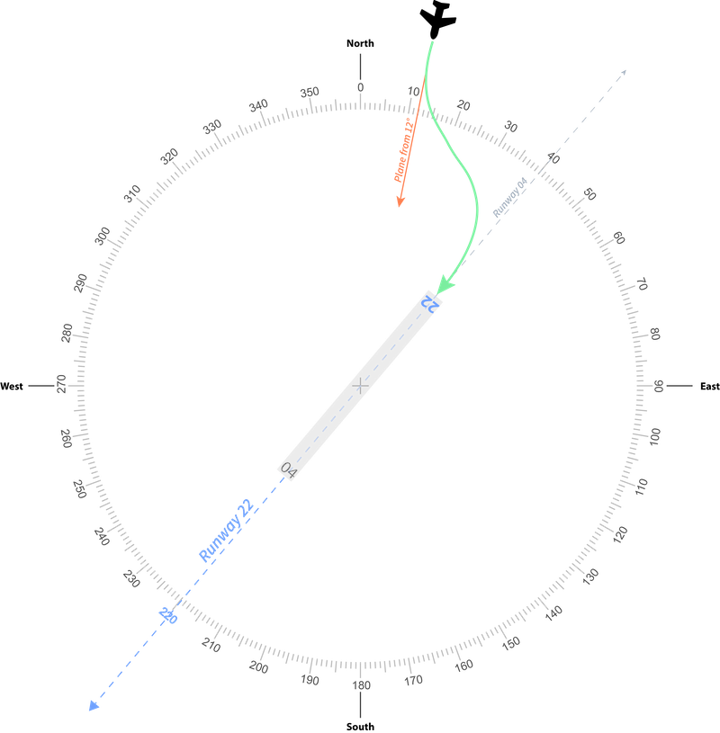

# Python - Airport Runway Direction

Source: https://platform.entwicklerheld.de/challenge/airport-runway-direction

## Build and run with Docker

You can build a Docker image and run it using these commands:

```shell script
docker build -t airport-runway-direction .
docker run -it airport-runway-direction
```

This will let you enter values for aiport and aircraft and determine the best runway.

## Description

In this task, you are in the role of the software developer of an airport. You should implement an algorithm which determines which runway
an incoming flight should take.

## Stage 1

### Goal

Every physical runway can be used in both directions and is named by the angle the runway is used. For example, an east-west runway is named
09/27 (the smaller number is always named first) and can be used as 09 when the aircraft is heading east or as 27 when its heading west.
Larger airports which have parallel runways add the position of the runway as seen from the landing plane. For example, three parallel
runways in west direction would be called “27L” (left), “27C” (center) and “27R” (right).

### Scenario 1: Airport Dresden

In this scenario you should implement the algorithm for the Airport in Dresden.

The Airport in Dresden has one physical runway which is called 04/22. It is windless. The following picture illustrates the airport and the
direction of the runways:



Now a flight is approaching from `12°` (North-North-East) as seen from the airport.
The `get_best_runway(self, aircraft: Aircraft)` function should return the runway that is the closest to the path of the plane.
Your function should choose runway `"22"`.



Your code should work for other flights as well.

### Scenario 2: Airport Frankfurt am Main

The airport in Frankfurt am Main is a more complex one. The airport has three parallel runways and one additional North-South track.

Frankfurt Airport has four runways: `07R/25L`, `07C/25C`, `07L/25R` and `18/36`. It is windless.

Now a flight is approaching to Frankfurt from `266°` (West-South-West).

There are multiple runways that could be chosen. It does not matter which runway you choose, but your function should either return
`"07R"`, `"07C"` or `"07L"`.

Your code should work for other flights as well.

### Scenario 3: A windy day in Frankfurt
So far we could ignore the weather conditions like wind. In this scenario, your algorithm should consider that a plane can only land against
the wind direction and choose the matching runway.

The airport is again Frankfurt with four runways: `07R/25L`, `07C/25C`, `07L/25R` and `18/36`.

The weather conditions in Frankfurt have changed. We now have a strong West-South-West wind (the current wind direction in degrees and the
wind speed are stored in the Airport class.)

When the wind speed is greater than 5 Knots then all airplanes should land against the wind direction. Choose the runway which direction is
as equal to the wind direction as possible.

Now a flight is approaching from `266°` (West-South-West).

There are multiple runways that can be chosen. It does not matter which runway you choose, but your function should either return
`"25R"`, `"25C"` or `"25L"`.

Your code should work for other flights as well.