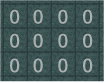
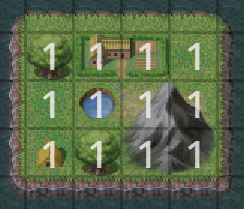
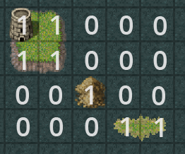
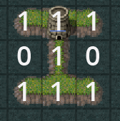
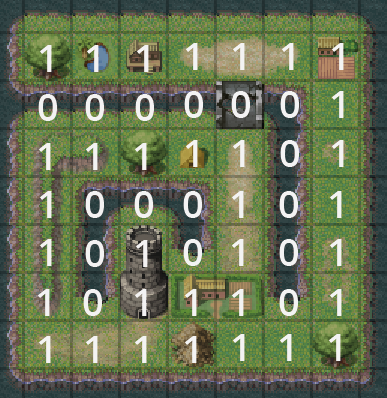
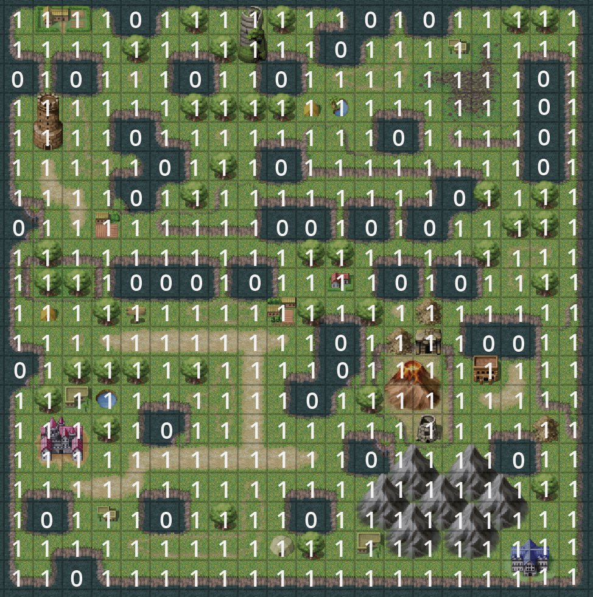

# Rust - Number of Islands

Source: https://platform.entwicklerheld.de/challenge/number-of-islands

## Build and run with Docker

You can build a Docker image and run it using these commands:

```shell script
docker build -t number-of-islands .
docker run number-of-islands
```

This will print the different scenarios and the result from the algorithm.

## Description

You have a 2D map with water (marked by 0) and land (marked by 1). Connected parts of land are forming an island. Your algorithm should
take such a map and return the number of islands. Many companies like Microsoft, Amazon or Visa ask this in an interview.

## Stage 1

### Goal

In a 2D map with water (marked by 0) and land (marked by 1). Connected land parts are forming an island. Your algorithm should take such
a map and return the number of islands. In this Stage you should try to create a sample map to make sure you understood the task.

### Scenario 1: Create sample Map

A map is a 2D Array of chars were '0' means water and '1' means land.

* Create a sample map and save it to the variable input.
* Your map should have 4 rows.
* Your map should have 3 columns per row.
* Every row should have at least one column with land (marked with the char '1' ).
* No other characters than '0' and '1' are allowed.
* Your map should have exactly 3 islands.

Tests: `cargo test -- stage1::tests --show-output`

## Stage 2

### Goal

Implement the numberOfIslands method to count and return the number of islands for a given char[][]. Keep your code readable and clean.

Tests: `cargo test -- stage2::tests`

### Scenario 1: Map with only water

Giving following map:



As the map contains only water your function should return `0` islands.

### Scenario 2: Map with only land

Giving following map:



As the map contains only land your function should return `1` island.

### Scenario 3: Map with diagonal unconnected island

Giving following map:



As island are not connected by diagonal land, your function should return `3`.

### Scenario 4: Map with one island connected by middle row

Giving following map:



The '1' in the middle row connects the first and second row to one island, so your function should return `1`.

### Scenario 5: Medium sized map

Giving following map:



Your function should return `1` for this map in reasonable time.

### Scenario 6: Big map

Giving following map:



Your function should return `1` for this map in reasonable time.
